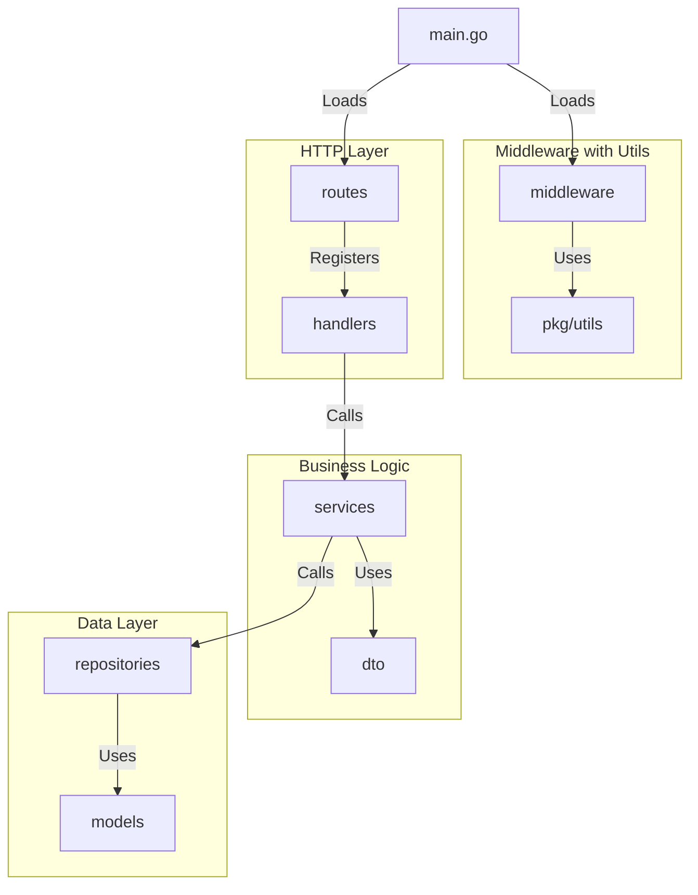
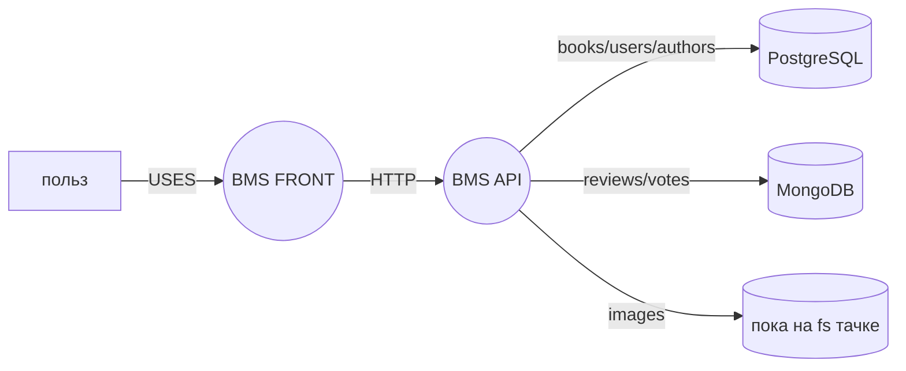
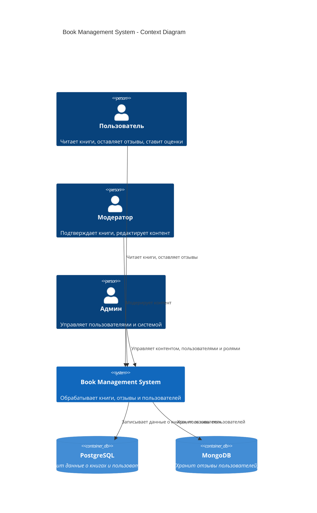
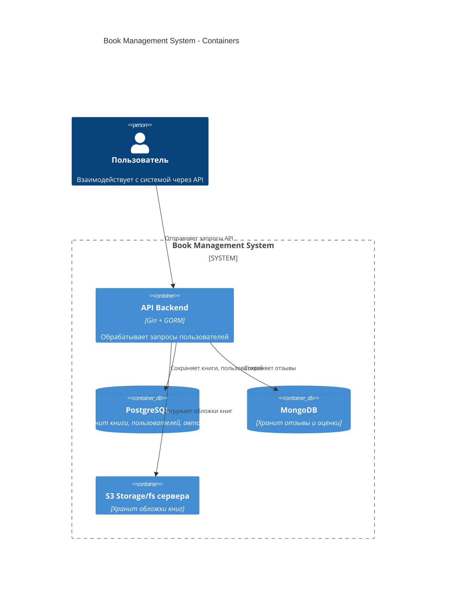
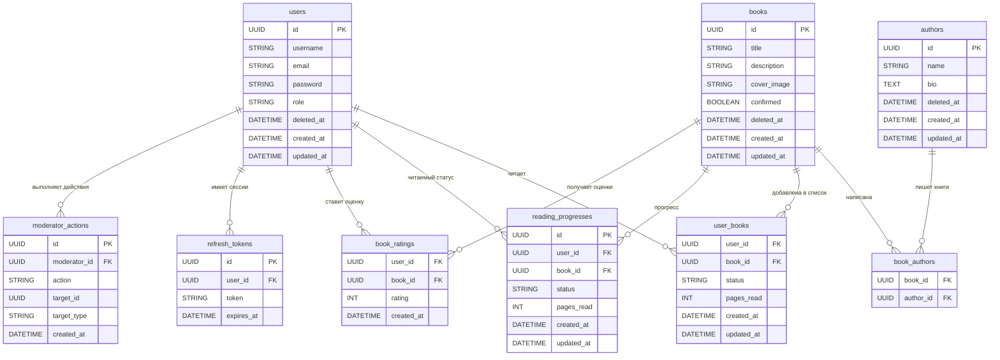

# 📚 Book Management System

## Описание
API для управления книгами, пользователями и отзывами.

## технологии
 - go 1.23
 - gin
 - gorm
 - postgres
 - mongo
 - cron


## 📌 руководство к запуску
Миграции осуществляется через make-команды

### Установка
1. **Установите зависимости**  
   ```sh
   make install
   ```

2. **Запустите базу данных**  
   ```sh
   make start-db
   ```

3. **Примените миграции**  
   ```sh
   make migrate-up
   ```

4. **Запустите сервер**  
   - Локально:
     ```sh
     make run-backend-local
     ```
   - В Docker:
     ```sh
     make run-backend-docker
     ```

---

## 📌 Работа с миграциями
**Создать новую миграцию**  
```sh
make new-migration
```

**Применить миграции**  
```sh
make migrate-up
```

**Откатить последнюю миграцию**  
```sh
make migrate-down
```

---

## 📌 Тестирование
**Запуск тестов:**  
```sh
make test
```

---

## 📌 API Документация
Swagger доступен по адресу:  
```
http://localhost:8080/swagger/index.html
```

---


## 📂 Структура проекта

📦 **cmd/** – точка входа в приложение  
📦 **internal/** – основной код приложения  
📂 **handlers/** – обработчики HTTP-запросов  
📂 **services/** – бизнес-логика  
📂 **repositories/** – работа с базами данных  
📂 **database/** – подключение к PostgreSQL и MongoDB  
📂 **middleware/** – мидлвари на авторизацию, ролевку и логирование  
📂 **dto/** – DTO для API  
📂 **pkg/** – утилсы (логгер, конвертации, jwt)  
📂 **migrations/** – SQL миграции  
📂 **docs/** – Swagger  
📄 **.env** – переменные окружения(должны быть `env.development`, `env.staging`, `env.production` )  
📄 **Dockerfile** – инструкции для контейнера бэка
📄 **docker-compose.yml** – описание сервисов инфры  
📄 **Makefile** – команды для CLI  
📄 **README.md** – документация  

## Графическое представление системы

### Как выглядит взаимодействие компонент:


### Верхнеуровневое устройство системы 


### Контекст C4


### Контейнеры C4


### ER логическая

---
## 📌 Контрибьютинг
1. Форкни репозиторий
2. Создай новую ветку (`feature/your-feature`)
3. Запусти `make test` перед коммитом
4. Сделай PR


---

## 📌 Контакты

[tg](https://t.me/fedtart)